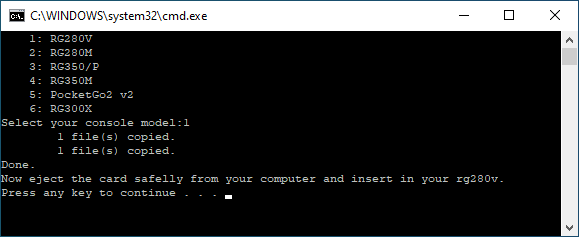
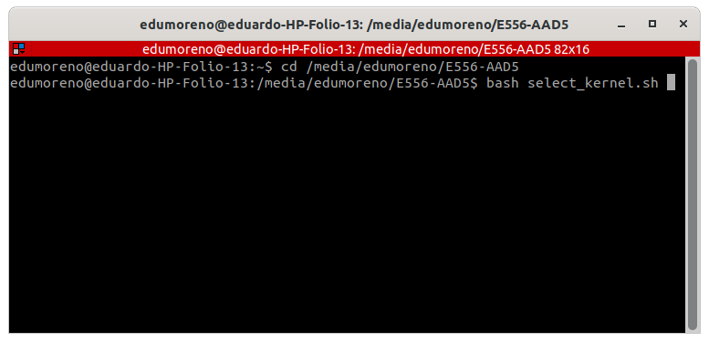
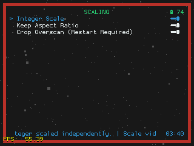
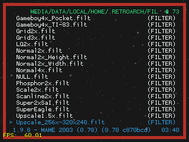

# Imagen Adán

Configuración de sistema para consolas RG350 y RG280 realizada por el Team RParadise:

* [Brumagix Gamer](https://www.youtube.com/channel/UCrdNisYjDd7qI1Zv2ZLwBrQ)
* [eduardofilo](https://apuntes.eduardofilo.es/)
* Juanmote (Juanma)
* [La Retro Cueva](https://www.youtube.com/channel/UCQm1VwD4sFoOUx6rq-at7jA)

La configuración está realizada en base a las siguientes partes:

* [OpenDingux](http://od.abstraction.se/opendingux/latest/). Gracias principalmente a [pcercuei](https://github.com/pcercuei).
* [SimpleMenu](https://github.com/fgl82/simplemenu). Gracias a [FGL82](https://github.com/fgl82).
* [RetroArch](https://www.retroarch.com/?page=platforms).
    * [Oficial](https://buildbot.libretro.com/nightly/dingux/mips32/).  Gracias principalmente a [jdgleaver](https://github.com/jdgleaver).
    * [Poligraf](https://github.com/Poligraf/opendingux_ra_cores_unofficial).  Gracias a [Poligraf](https://github.com/Poligraf).
* Aplicaciones standalone:
    * [ColecoD](https://boards.dingoonity.org/gcw-releases/colecod-v1-0/). Gracias a [alekmaul](https://github.com/alekmaul).
    * [Daphne](https://github.com/DavidKnight247/Daphne). Gracias a [DavidKnight247](https://github.com/DavidKnight247).
    * [FBA](https://github.com/plrguez/fba-sdl/releases/latest). Gracias a [plrguez](https://github.com/plrguez).
    * [JzIntv](https://github.com/eduardofilo/jzIntv/releases). Gracias a [DavidKnight247](https://github.com/DavidKnight247).
    * [PCSX4All](https://github.com/jdgleaver/RG350_pcsx4all/releases/latest). Gracias a [jdgleaver](https://github.com/jdgleaver).
    * [ReGBA](https://github.com/jdgleaver/ReGBA/releases/latest). Gracias a [jdgleaver](https://github.com/jdgleaver).
    * [Tac08](https://0xcafed00d.itch.io/tac08-rg350). Gracias a [0xCAFED00D](https://itch.io/profile/0xcafed00d).
    * [VbEmu](https://gitlab.com/gameblabla/gameblabla-releases/-/blob/master/opk/gcw0/vbemu_gcw0.opk). Gracias a [gameblabla](https://gitlab.com/gameblabla).
    * [xMAME](http://www.slaanesh.net/). Gracias a [Slaanesh](https://www.blogger.com/profile/15791750842821351775). Instalado [este](https://github.com/eduardofilo/RG350_xmame_sm_bridge) interfaz de ajustes.
    * [Commander](https://github.com/od-contrib/commander/releases/latest). Gracias a [glebm](https://github.com/glebm).
    * [PyBackup](https://github.com/eduardofilo/RG350_py_backup/releases/latest)

## Procedimiento de instalación

1. Descargar la imagen del apartado [releases de este repositorio](https://github.com/eduardofilo/RG350_adam_image/releases/latest).
2. Sin necesidad de descomprimir, flashear el archivo con [Balena Etcher](https://www.balena.io/etcher/) sobre una microSD de al menos 4GB.
3. Montar la tarjeta en un ordenador. Si la acabamos de flashear, dependiendo del sistema operativo, puede ser necesario extraerla del lector y volverla a insertar. En Windows se montará una de las dos particiones que contiene la tarjeta y la otra dará error. El error es normal dado que la segunda partición es de tipo Linux.
4. Colocar el kernel adecuado al modelo de nuestra consola. Esto puede hacerse de varias maneras en función del sistema operativo:

#### Windows

1. Abrir el script `select_kernel.bat` que hay en la partición que se monta correctamente, haciendo doble clic sobre él.
    
2. Aparecerá una consola negra donde tendremos que teclear el número correspondiente a nuestro modelo de consola del listado que veremos.
    
3. Pulsar Retorno y cuando se nos indique, expulsar la tarjeta con seguridad.
    

#### Linux

1. Abrir un terminal y cambiar el directorio actual a la ruta correspondiente a la partición 1 de la tarjeta (podemos averiguar el punto de montaje en nuestro sistema con el comando `df`). Desde ese directorio ejecutar el comando `bash select_kernel.sh`.
    
2. Aparecerá un diálogo que nos invitará a seleccionar nuestro modelo de consola con las teclas de cursor.
    
3. Pulsar Retorno y cuando se nos indique, expulsar la tarjeta con seguridad.
    

#### Cualquier sistema

Hay un tercer método válido para cualquier sistema operativo (Windows, Linux, Mac). Se trata de visualizar con el explorador de archivos la partición 1 de la tarjeta y copiar manualmente los dos ficheros que hay dentro del directorio correspondiente a nuestro modelo de consola a la raíz de esa partición. Al ser una partición FAT32, no debería haber problema para acceder a los ficheros desde cualquier sistema.

[](https://www.youtube.com/watch?v=CQSBWOTO2zc "Ver vídeo")

## Instalación de contenidos

La imagen está vacía de contenidos. Sólo contiene el sistema, los cores RetroArch y unos pocos emuladores independientes. Toda la configuración se ha hecho con la idea de que los contenidos sean instalados en la tarjeta externa.

#### Label de tarjeta externa

Para que todas las rutas preconfiguradas en la imagen funcionen, es necesario que la tarjeta microSD externa tenga formato FAT32 y **NO** tenga definida una etiqueta o label. En caso de haber label habrá que borrarlo.

En Windows podemos hacerlo desde el cuadro de Propiedades de la unidad como vemos en el siguiente vídeo:

[](https://www.youtube.com/watch?v=3uAMibsOvvk "Ver vídeo")

En Linux se puede hacer ejecutando el siguiente comando desde un terminal (en el ejemplo se ha usado el dispositivo `/dev/mmcblk0p1`, pero habrá que sustituirlo por el que corresponda en nuestro caso):

```bash
sudo fatlabel /dev/mmcblk0p1 -r
```

#### Rutas

El frontend SimpleMenu ha sido configurado con una serie de rutas predefinidas donde tratará de localizar las ROMs y previsualizaciones de las mismas. Si no queremos modificar la configuración de SimpleMenu, habrá que ajustarse a estas rutas. En la tabla siguiente se indica en la primera columna el nombre del directorio que tendrá que existir en la ruta `/media/sdcard/roms` en el sistema de la consola. Este directorio se corresponde con la carpeta `apps` en la raíz de la tarjeta externa cuando se monta en un PC. Por ejemplo el directorio `/media/sdcard/roms/GB` del sistema Game Boy lo encontraremos en `roms/GB` en la tarjeta externa montada en el ordenador.


Las previews deberán colocarse en un directorio de nombre `.previews` dentro de cada uno de los directorios de ROMs del listado anterior. Por ejemplo las previews de las ROMs de GB deberán situarse en `/media/sdcard/roms/GB/.previews`.

## Controls

Documentar controles (salida de FBA y xMAME)

## Unsupported video mode

Sometimes with RetroArch emulators (cores) you will see the following error screen:


In that case proceed in this way:

1. Open RetroArch (`Select + X`).
2. Go to `Main Menu > Settings > Video > Scaling` and check `Integer Scale` and `Keep Aspect Ratio` options.

    

3. Go to `Main Menu > Settings > Video > Video Filter` and select the filter `Upscale_256x-320x240.filt` (the last one):

    

By last, if you don't want to make this settings all the time, go to `Main Menu > Quick Menu > Overrides` and select `Save Game Overrides`.

## RetroArch setup

https://github.com/eduardofilo/RG350_auto_ra_installer/blob/master/adam.csv

Forzar salida de RA si no funcionan Select+Start
